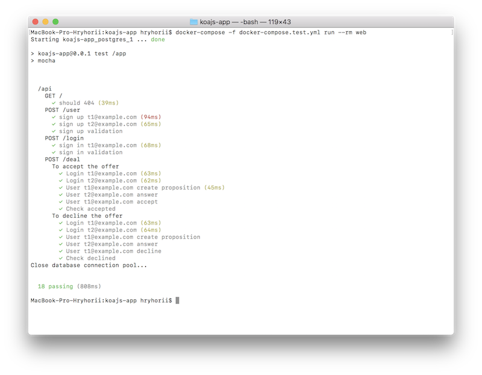

# Koa application

<p align="left">
 
 
 
 

 [](https://nodejs.org/)
 [](https://koajs.com/)
 [](https://www.openapis.org/)
 [](https://swagger.io/)
 [](https://www.postgresql.org/)
 [](https://en.wikipedia.org/wiki/MIT_License)
</p>

## Usage

Check configs in file ``PROJECT_ROOT/config.js`` or environment variables.

Run application

```bash
docker-compose up

# or

npm install && npm run start
```

For example, configure app to run on ``localhost:3000``

 - http://localhost:3000/ - Main page
 - http://localhost:3000/api/ - API endpoint
 - http://localhost:3000/openapi.json - Open API schema
 - http://localhost:3000/openapi.html - Swagger location (API description)

## Tests

Run tests console command:

```bash
docker-compose -f docker-compose.test.yml run --rm web
```

## Features

 - [x] Backend
 - [x] Frontend
 - [x] Docker
 - [X] Tests (in progress)

## License

MIT
