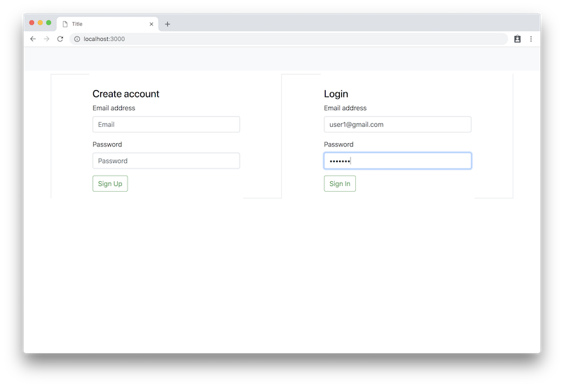

# Koa application

<p align="center">
 
 
 

 [](https://nodejs.org/)
 [](https://koajs.com/)
 [](https://www.openapis.org/)
 [](https://swagger.io/)
 [](https://www.postgresql.org/)
 [](https://www.postgresql.org/)
</p>

## Usage

Check configs in file ``PROJECT_ROOT/config.js``.
See environment variables.

### Usage

Run application

```$bash
docker-compose up

# or

npm install && npm run start
```

For example, configure app to run on ``localhost:3000``

 - http://localhost:3000/api/ - API endpoint
 - http://localhost:3000/openapi.json - Open API schema
 - http://localhost:3000/openapi.html - Swagger location (API description)

## Features

 - [x] Backend
 - [x] Frontend
 - [x] Docker
 - [ ] Tests (in progress)

## Main components

 - Koa web framework (https://koajs.com/)
 - Sequelize ORM (http://docs.sequelizejs.com/)
 - OpenAPI 3 (https://github.com/OAI/OpenAPI-Specification/blob/master/versions/3.0.0.md)

## License

MIT
